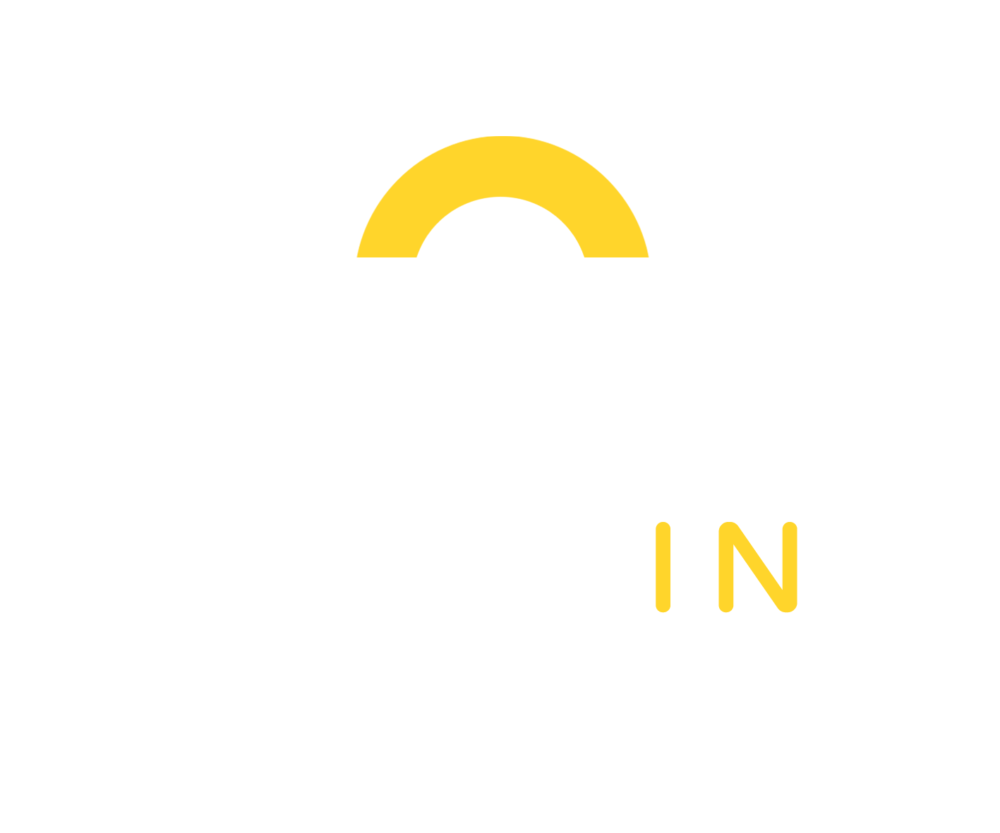

<h4 id="readme-top">

[![Contributors][contributors-shield]][contributors-url]
[![Stars][stars-shield]][stars-url]
[![GPL License][license-shield]][license-url]


<br />
<div align="center">
  <a href="https://github.com/incrisvel/parkin">
    
  </a>
  


  <p align="center">
    <br />
    <a href="https://github.com/incrisvel/parkin.git"><strong>Explore »</strong></a>
    <br />
    <br />
    <a href="https://github.com/incrisvel/parkin">Demo</a>
    ·
    <a href="https://github.com/incrisvel/parkin/issues">Reportar bug</a>
    ·
    <a href="https://github.com/incrisvel/parkin/issues">Requerir feature</a>
  </p>
</div>

<details>
  <summary>Índice</summary>
  <ol>
    <li>
      <a href="#sobre-o-projeto">Sobre o projeto</a>
      <ul>
        <li><a href="#ferramentas">Ferramentas</a></li>
      </ul>
    </li>
    <li>
      <a href="#getting-started">Getting Started</a>
      <ul>
        <li><a href="#pré-requisitos">Pré-requisitos</a></li>
        <li><a href="#instalação">Instalação</a></li>
      </ul>
    </li>
    <li><a href="#uso">Uso</a></li>
    <ul>
        <li><a href="#clientes">Clientes</a></li>
        <li><a href="#estacionamentos">Estacionamentos</a></li>
    </ul>
    <li><a href="#implementações">Implementações</a></li>
    <li><a href="#contribuir">Contribuir</a></li>
    <li><a href="#licença">Licença</a></li>
    <li><a href="#contato">Contato</a></li>
  </ol>
</details>


## Sobre o projeto

[![Product Name Screen Shot][product-screenshot]](https://example.com)

ParkIn é uma iniciativa dedicada a revolucionar a maneira como as pessoas encontram e utilizam estacionamentos urbanos. 

Proporciona uma experiência personalizada para os usuários, além de uma plataforma robusta e intuitiva de gestão aos proprietários. 

Alguns diferenciais oferecidos:
* Vagas em tempo real
* Monitoramento simplificado
* Segurança de dados

Em desenvolvimento ativo desde 16/01/2024. O progresso foi registrado em [dailies](DAILIES.md).


<p align="right"><a href="#readme-top">Início</a></p>


### Ferramentas

Recursos utilizados no desenvolvimento:


- Linguagens

    [![Python][Python.com]][Python-url]
    [![HTML5][HTML5.com]][HTML5-url]
    [![CSS3][CSS3.com]][CSS3-url]
    [![Javascript][Javascript.com]][Javascript-url]

- Frameworks/bibliotecas

    [![Django][Django.com]][Django-url]
    [![Bootstrap][Bootstrap.com]][Bootstrap-url]

- Controle de versão

    [![Git][Git.com]][Git-url]
    [![Github][Github.com]][Github-url]

- Banco de dados

    [![SQLite][SQLite.com]][SQLite-url]

- IDE

    [![VSCode][VSCode.com]][VSCode-url]

- Design e organização

    [![Trello][Trello.com]][Trello-url]
    [![Figma][Figma.com]][Figma-url]
    [![Canva][Canva.com]][Canva-url]

<p align="right"><a href="#readme-top">Início</a></p>


## Getting Started

Para ter uma cópia local siga estes passos simples.

### Pré-requisitos

Listar itens necessários para usar o software e como instalá-los.
* npm
  ```sh
  npm install npm@latest -g
  ```

### Instalação

1. Clone o repositório
   ```sh
   git clone https://github.com/incrisvel/parkin.git
   ```
2. Instale as bibliotecas
   ```sh
   pip install -r requirements.txt
   ```
3. Inicialize o banco de dados
   ```sh
   python manage.py makemigrations
   python manage.py migrate
   ```

<p align="right"><a href="#readme-top">Início</a></p>


## Uso

A visão do ParkIn se estende tanto aos motoristas em busca de vagas quanto aos responsáveis pelos estabelecimentos. Vamos explorar funcionalidades implementadas para estes grupos.

### Clientes

1. Cadastro;
2. Login;
3. Visualização do mapa interativo.

### Estacionamentos

1. Cadastro;
2. Login;
3. Tela de dashboard.

<p align="right"><a href="#readme-top">Início</a></p>


## Implementações

Uma lista das implementações a serem incorporadas:

- [ ] Instalação de sensores (hardware)
- [ ] Registro de atividade
- [ ] Validação
    - [ ] CNPJ
    - [ ] e-mail

Veja a página [open issues](https://github.com/incrisvel/parkin/issues) para uma lista de features sugeridas.

<p align="right"><a href="#readme-top">Início</a></p>


## Contribuir

Contribuições são essenciais para a comunidade open source. **Todas as contribuições são altamente apreciadas.**

Se você tem uma sugestão que poderia melhorar este projeto, por favor, crie um pull request. Não se esqueça de nos dar uma estrela! A equipe ParkIn agradece.

  1.  Faça um fork do repositório
  2.  Crie uma branch para sua feature  (`git checkout -b feature/FeatureLegal`)
  3.  Faça commits das suas mudanças  (`git commit -m 'Adiciona FeatureLegal'`)
  4.  Faça push para a branch  (`git push origin feature/FeatureLegal`)
  5.  Abra um pull request

<p align="right"><a href="#readme-top">Início</a></p>


## Licença

Este projeto é licenciado sob a GNU GENERAL PUBLIC LICENSE. Veja a [licença](LICENSE) para mais informações.

<p align="right"><a href="#readme-top">Início</a></p>


## Contato

Entre em contato com a equipe em parkin2123@gmail.com.

Saiba mais sobre os autores do projeto:

- [![Ana Alice Rodrigues][AAR.com]][AAR-url]
- [![Arthur Henrique Erhardt][AHE.com]][AHE-url]
- [![Bianca Lanser Peres][BLP.com]][BLP-url] 
- [![Cristina Siewert Jansen][CSJ.com]][CSJ-url] 
- [![Marco Aurélio Ribeiro Martins][MARM.com]][MARM-url]
- [![Ryan Wessling da Silva][RWS.com]][RWS-url]


<p align="right"><a href="#readme-top">Início</a></p>


[contributors-shield]: https://img.shields.io/github/contributors/incrisvel/parkin.svg?style=for-the-badge
[contributors-url]: https://github.com/incrisvel/parkin/graphs/contributors
[stars-shield]: https://img.shields.io/github/stars/incrisvel/parkin.svg?style=for-the-badge
[stars-url]: https://github.com/incrisvel/parkin/stargazers
[license-shield]: https://img.shields.io/badge/license-GPL-yellow?style=for-the-badge
[license-url]: https://github.com/incrisvel/parkin/tree/main?tab=GPL-3.0-1-ov-file#GPL-3.0-1-ov-file

[product-screenshot]: images/screenshot.png

[Figma.com]: https://img.shields.io/badge/Figma-F24E1E?style=for-the-badge&logo=figma&logoColor=white
[Figma-url]: https://www.figma.com 
[Canva.com]: https://img.shields.io/badge/Canva-%2300C4CC.svg?&style=for-the-badge&logo=Canva&logoColor=white
[Canva-url]: https://www.canva.com 
[Django.com]: https://img.shields.io/badge/Django-092E20?style=for-the-badge&logo=django&logoColor=green
[Django-url]: https://www.djangoproject.com
[HTML5.com]: https://img.shields.io/badge/HTML5-E34F26?style=for-the-badge&logo=html5&logoColor=white
[HTML5-url]: https://html.com
[CSS3.com]: https://img.shields.io/badge/CSS3-1572B6?style=for-the-badge&logo=css3&logoColor=white
[CSS3-url]: https://www.w3.org/TR/CSS/#css
[Javascript.com]: https://img.shields.io/badge/JavaScript-323330?style=for-the-badge&logo=javascript&logoColor=F7DF1E
[Javascript-url]: https://ecma-international.org/publications-and-standards/standards/ecma-262
[Python.com]: https://img.shields.io/badge/Python-FFD43B?style=for-the-badge&logo=python&logoColor=blue
[Python-url]: https://www.python.org
[Trello.com]: https://img.shields.io/badge/Trello-0052CC?style=for-the-badge&logo=trello&logoColor=white
[Trello-url]: https://trello.com
[SQLite.com]: https://img.shields.io/badge/sqlite-%2307405e.svg?style=for-the-badge&logo=sqlite&logoColor=white
[SQLite-url]: https://www.sqlite.org/index.html
[Bootstrap.com]: https://img.shields.io/badge/bootstrap-%238511FA.svg?style=for-the-badge&logo=bootstrap&logoColor=white
[Bootstrap-url]: https://getbootstrap.com
[VSCode.com]: https://img.shields.io/badge/Visual%20Studio%20Code-0078d7.svg?style=for-the-badge&logo=visual-studio-code&logoColor=white
[VSCode-url]: https://code.visualstudio.com
[Git.com]: https://img.shields.io/badge/git-%23F05033.svg?style=for-the-badge&logo=git&logoColor=white
[Git-url]: https://git-scm.com
[Github.com]: https://img.shields.io/badge/github-%23121011.svg?style=for-the-badge&logo=github&logoColor=white
[Github-url]: https://github.com

[AAR.com]: https://img.shields.io/badge/Ana_Alice_Rodrigues-blue?style=for-the-badge
[AAR-url]: https://linktr.ee/anaeanali5
[AHE.com]: https://img.shields.io/badge/Arthur_Henrique_Erhardt-grey?style=for-the-badge
[AHE-url]: https://linktr.ee/arthurerhardt
[BLP.com]: https://img.shields.io/badge/Bianca_Lanser_Peres-yellow?style=for-the-badge
[BLP-url]: https://linktr.ee/bia_peres
[CSJ.com]: https://img.shields.io/badge/Cristina_Siewert_Jansen-blue?style=for-the-badge
[CSJ-url]: https://linktr.ee/cristinasj
[MARM.com]: https://img.shields.io/badge/Marco_Aur%C3%A9lio_Ribeiro_Martins-grey?style=for-the-badge
[MARM-url]: https://linktr.ee/marco.arm
[RWS.com]: https://img.shields.io/badge/Ryan_Wessling_da_Silva-yellow?style=for-the-badge
[RWS-url]: https://linktr.ee/ryanwds101
